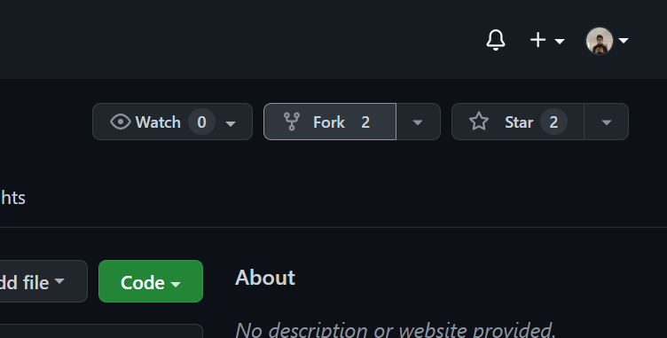
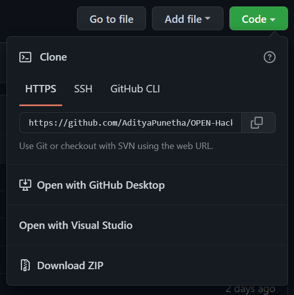
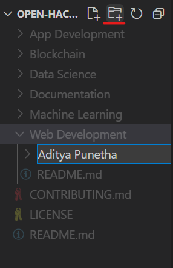
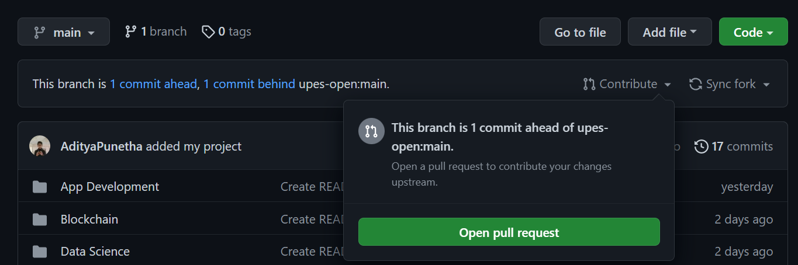

<div  align=center>
  &nbsp;&nbsp;&nbsp;&nbsp;&nbsp;&nbsp;&nbsp;&nbsp;&nbsp;&nbsp;&nbsp;&nbsp;&nbsp;&nbsp;&nbsp;&nbsp;&nbsp;&nbsp;&nbsp;&nbsp;&nbsp;&nbsp;&nbsp;&nbsp;&nbsp;&nbsp;&nbsp;&nbsp;&nbsp;&nbsp;&nbsp;
  
</div>

## Start you Open Source Journey with UPES Open Community :rocket:

## Guidelines for contributions

1. This is a beginner friendly repository. If you any small project from any domain on which you are working and would like to contribute it as a open source project. This is the repo for you.
2. We are accepting project from any domains.
3. You can contribute documentation too.
4. The documentation must be in the form of article. The topic of article can be technical or non-tech(open source programs, interview experiences, etc).
5. We have strict policy against plagiarism, so make sure you are not copying anything from anywhere.
6. Make sure to add references.
7. If you will follow these guidelines, you are good to go!

# Happy Contributing :green_heart:

### Do Star ⭐ this Repo then Fork🍴

## Rules:

- Create an issue and then do a pull request
- Write good-quality code with comments also.
- Spammy code is not accepted.
- Only proper projects will be merged.

## How to make changes?

- Fork this repo by clicking on the fork button on the top right and then click on create fork.
  

  This will create a copy of this repository in your account.

- Clone the forked repository to your local machine by clicking on the green button that says "Code" and then copy the URL.

  

- Open the terminal and type the following command:

  ```bash
  git clone <url you copied>
  ```

  where `<url you copied>` is the URL of this repository (your fork of this project).

- Create a folder with your name and add your project in it along with a readme file explaining the project.

  

- Add your files by typing (`git add .`), commit (`git commit -m "commit message"`) and push (`git push`) in the terminal.

- Create a pull request by clicking on the green button that says "Compare and Pull Request".
  

- Add a title and description to your pull request that explains your contribution.

- Click on "Create Pull Request".

- Wait for your PR review and merge approval!

#### NOTE: If you want us to add other domains, please raise an issue. We will love to hear your suggestions.
